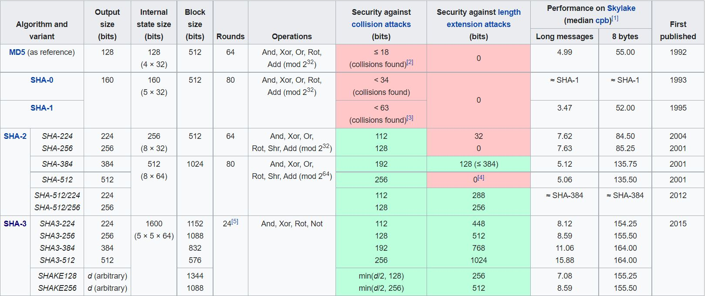

# 0 Algorithms

## 0.1 Secure Hash Algorithms

The Secure Hash Algorithms are a family of cryptographic hash functions published by the National Institute of Standards and Technology (NIST) as a U.S. Federal Information Processing Standard (FIPS), including:
1. **SHA-0:** A 160-bit hash function
2. **SHA-1:** A 160-bit hash function that shares characteristics similar to the MD5 hash function
3. **SHA-2:** It consists of two hash functions with different block sizes SHA-256 and SHA-512 and additionally, there are four truncated versions.
4. **SHA-3:** It is formerly known as Keccak as it supports the same hash lengths as SHA-2, and its internal structure differs significantly from the rest of the SHA family. 

### 0.1.1 SHA3-512
In this model, we have used SHA-3 as a principal hashing algorithm. It is because SHA-0 and SHA-1 is no longer used in real-world applications due to security vulnerabilities. SHA-3 is considered a more secure option than SHA-2 as its internal structure differs significantly from the rest of the SHA family.

The comparison among all families of SHA in terms of security: 



The aim is to implement dynamic encryption using AES where the cipher key will vary according to the information passed. As AES-512 is designed and used to encrypt data which requires 512 bits of cipher key, therefore it is more suitable to use SHA3-512 which generates 512 bits of hash that can be easily passed to the AES algorithm.


### 0.1.2 SHA3-512 Implementation

As SHA3-512 is capable to withstand collision attacks and length extension attacks [x] therefore it is far more secure and efficient. To implement this algorithm, we will be using an external module name **hashlib** in Python programming language. This module provides us with most of the algorithms belonging to the SHA family.

1. Checking the presence of SHA3-512 

```py
import hashlib

# Available algorithm
print(hashlib.algorithms_guaranteed)
```
 
```txt
{
    ‘blake2b’, ‘shake_256’, ‘sha512’, ‘sha3_224’, 
    ‘sha384’, ‘sha3_512’, ‘sha3_256’, ‘sha3_384’, 
    ‘md5’, ‘sha256’, ‘sha224’, ‘sha1’, ‘blake2s’, 
    ‘shake_128’
}
```

We can observe that the algorithm **‘sha3_512’** exist.


2. Using SHA3-512

```py
import sys
import hashlib

if sys.version_info < (3, 6):
	import sha3

str = "CSHB Model"

# create a sha3 hash object
hash_sha3_512 = hashlib.new("sha3_512", str.encode())

print("\nSHA3-512 Hash: \n", hash_sha3_512.hexdigest())
```

```txt
SHA3-512 Hash:
fe3a5c5d82571204dce93169a1d8bedf1857a986d71437ff73090b8f3930c1825275ff565b935e2edc76212d9fb218710438770f1a939b43931b5d280e1e22ee
```


## 0.2 Base64

An encoding scheme that converts binary data into text format so that encoded textual data can be easily transported over the network without being corrupted or any data loss. The problem that arises while sending normal binary data is that bits can be misinterpreted by underlying protocols, and produce incorrect data at receiving node. The term Base64 is taken from the Multipurpose Internet Mail Extension (MIME) standard, which is widely used for HTTP and XML, and was originally developed for encoding email attachments for transmission. 

Base64 encoding and decoding are mainly used in Advance Encryption Standard to represent the encrypted data in this format or to decrypt the message represented in this format. As the encryption and decryption algorithm will require changing base64 data to binary and vice-versa, therefore the use of base64 is considered.

### 0.2.1 Base64 Implementation

The implementation of base64 is simple where the  process of converting binary data into a limited character set of 64
characters. The characters are A-Z, a-z, 0-9, +, and /. This character set is considered the
most common character set, and is referred to as MIME’s Base64. The 6 consecutive bits are converted to specific ASCII character and in case bits are not sufficient then it is padded.


To implement this algorithm we use a predefined module name **base64** in Python programming language.

```py
from base64 import b64encode, b64decode

DATA = 'data to be encoded'

encoded = b64encode(DATA)
print('Encoded: ', encoded)

decode = base64.b64decode(encoded)
print('Decoded: ', decoded)
```

OUTPUT

```txt
Encoded: ZGF0YSB0byBiZSBlbmNvZGVk
Decoded: data to be encoded
```


## 0.3 Advance Encryption Standard

The Advanced Encryption Standard (AES) is a symmetric key encryption, also known as Rijndael is a specification for the encryption of electronic data established by the U.S. National Institute of Standards and Technology (NIST) in 2001. AES is a variant of the Rijndael block cipher which is a family of ciphers with different key and block sizes. For AES, NIST selected three members of the Rijndael family, each with a block size of 128 bits, but three different key lengths: 128, 192 and 256 bits.

The three types of AES mainly used are:
1. AES-128
2. AES-192
3. AES-256

AES operates on a 4 × 4 column-major order array of 16 bytes `b0, b1, b2, ... b15` termed the state:


### 0.3.1 High-level Algorithm Description
This algorithm can be divided into 4 parts: Key Scheduling, Encryption Process, Decryption Process, and Padding. The encryption and decryption process follows a similar process but with different operations. The Key Scheduling algorithm is performed on the cipher key which is used both in the Encryption Process to encrypt the data and in the Decryption Process to decrypt the cipher data. However, the data which undergoes AES may or may not be in the multiple of 128 bits. Therefore in order to fit this data to a 4 × 4 column-major order array of 16 bytes, padding is used before encryption and it is removed after decryption.

#### 0.3.1.1 Key Scheduling

It is a process of key expansion where a short key is expanded into a number of separate round keys that are used at different rounds in the encryption-decryption process. 

The number of round keys generated for different variants of AES is 

| AES | Key Length | Round Key Generated | Total(Including initial key) |
| :---: | :---: | :---: | :---: |
| 128 | 128b / 16B | 10 | 11 |
| 192 | 192b / 24B | 12 | 13 |
| 256 | 256b / 32B | 14 | 15 |

<br/>

The operations involved in Key Scheduling are:

1. **Rot Word**: It is defined as one byte left-circular shift

 RotWord([b0, b1, b2, b3]) = [b1, b2, b3, b0]

2. **Sub Word**: The substitution of the four bytes of the word using AES S-Box.

 SubWord([ b0, b1, b2, b3 ]) = [ S(b0), S(b1), S(b2), S(b3) ]

3. **Round Constants**: The round constant (rcon_i) for round 'i' of the key expansion is the 32-bit word is given by:

rcon_i = [ rc_i, (00)16, (00)16, (00)16 ]

The value of rc_i is an eight-bit value defined by:


where ⊕  are the bitwise XOR operator and constants such as (00)16 and (11B)16 are given in hexadecimal.

The value of rc_i in hexadecimal up to i=10

| i | 1 | 2 | 3 | 4 | 5 | 6 | 7 | 8 | 9 | 10 |
| :---: | :---: | :---: | :---: | :---: | :---: | :---: | :---: | :---: | :---: | :---: |
| rc_i | 01 |  02 | 04 | 08 | 10 | 20 | 40 | 80 | 1B | 36 |

The round constant used by variants of AES are:

| AES |  Round Constant Used (i) |  
| --- | :---: |
| 128 | rcon_10 |
| 192 | rcon_8 |
| 256 | rcon_7 |

<br/>

Key Expansion in Key Scheduling
- If we consider 32 bit / 4 bytes as 1 word then according to key length, there will be 4 words for AES-128, 6 words for AES-192, and 8 words for AES-256
- Let the words be represented by `N`
- Let `K0, K1, ... KN-1` as the 32-bit words of the original key
- Let `R` as the number of total round keys needed.
- Let `W0, W1, ... W4R-1` as the 32-bit words of the expanded key
- Then for `i` in range from 0 to 4*R - 1 the expanded value of `W_i` is calculated as


#### 0.3.1.2 Encryption

In this process, the plain text is divided into 128-bit text and for each division, encryption is performed. It uses the round keys generated in the Key Scheduling to obtain a cipher text at each round. The rounds consist of an initial round, an intermediate round, and the final round and it varies depending on the variants of AES.

The different operations involved are:

1. SubBytes

It is the byte substitution process where the state array is substituted by the values in S-Box. This S-Box is used because it is derived from the multiplicative inverse over GF(2^8) which is known to have good non-linearity properties.


2. ShiftRows

The ShiftRows step operates on the rows of the state; it cyclically shifts the bytes in each row by a certain offset. For AES, the first row is left unchanged. Each byte of the second row is shifted to the left. Similarly, the third and fourth rows are shifted by offsets of two and three respectively.


3. MixColumn

In this process, the four bytes of each column of the state are combined using an invertible linear transformation. The operation consists of the modular multiplication of two four-term polynomials whose coefficients are elements of GF(2^8). The modulus used for this operation is x^{4}+1.


In this case, the circulant matrix is generated using [2 3 1 1]

It is similar to Matrix Multiplication but with different operation types.XOR operation is performed instead of Addition. Multiplication is modulo irreducible polynomial {x^{8}+x^{4}+x^{3}+x+1}. If processed bit by bit, then, after shifting, a conditional XOR with 1B16 should be performed if the shifted value is larger than FF16 (overflow must be corrected by subtraction of generating polynomial). These are special cases of the usual multiplication in GF(2^8).


4. AddRoundKey

In this process, the round keys generated from the Key scheduling is combined with the state using XOR operations


<br/>

For performing AES encryption the steps are:
- Initial Round 
    - Perform AddRoundKey() with the cipher key
- Intermediate Round
    - SubBytes()
    - ShiftRows()
    - MixColumn()
    - AddRoundKey() with 'n'th round key
- Final Round
    - SubBytes()
    - ShiftRows()
    - AddRoundKey() with the last round key

 [Image]

#### 0.3.1.3 Decryption

The decryption process in AES is similar to its encryption operation but with some differences in the order and the nature of the operations.

The different operations involved are

1. Inverse SubBytes

The process is similar to SubBytes but instead of substituting the value from the S-Box, it uses Inverse S-Box.

2. Inverse ShiftRows

The rows are shifted in reverse order of the offset as applied in the ShiftRows.

3. MixColumn

This process is also the same in nature but it uses a different circulant matrix which is the inverse of [2 3 1 1]. 


** replace [2 3 1 1] with [0x0e, 0x0b, 0x0d, 0x09]

In this case, the circulant matrix which is used is [14 11 13 9]

4. AddRoundKey

In this process, the round keys generated from the Key scheduling are combined with the state using XOR operations in reverse order.


<br/>

For performing AES decryption the steps are:
- Initial Round 
    - Perform AddRoundKey() with last round key
- Intermediate Round
    - Inverse SubBytes()
    - Inverse ShiftRows()
    - AddRoundKey() with 'n'th round key from the end
    - MixColumn()
- Final Round
    - SubBytes()
    - ShiftRows()
    - AddRoundKey() with cipher key


 [Image]

#### 0.3.1.4 Padding

As the AES family use 128 bits of data to perform operation therefore it is also important to ensure that the data should fit into that array. However not all data can be a perfect fit, hence padding of extra bits is required. Apart from padding, it is also important to identify and fetch the correct data by removing those padding.

Algorithm to Add Padding
1. x := No. of vacant spaces to be filled
2. y := Hexadecimal form of 'x'
3. Add all the vacant space with 'y' (A hexadecimal form of 'x')

For instance, if the total character required is 16.

```txt
TEXT := 012345
x := Vacant Space = (16 - 6) = 10
y := Hexadecimal Form = 0a

Append '0a' 10 times to Text

The TEXT after padding:
** ** ** ** ** ** 0a 0a 0a 0a 0a 0a 0a 0a 0a 0a
```

Implementation in Python Programming Language
```py
#self.ORDER = 4 (For Square Matrix with order 4)
def __addPadding(self, data):
    bytes = self.ORDER**2           # 16 bytes
    bits_arr = []
    while(True):                    # Loop through the text
        if(len(data) > bytes):      # No Padding
            bits_arr.append(data[:bytes])
            data = data[bytes:]
        else:                       # Padding
            space = bytes-len(data) # Calculate vacant space
            bits_arr.append(data + chr(space)*space)    # Add Padding
            break
    return bits_arr
```

<br/>

Algorithm to Delete Padding
1. x := Get the last character
2. y := Get the Decimal value of 'x'
3. z := Construct a substring by appending 'x' by 'y'
4. Compare 'z' with the text from the end

For instance, if the total character required is 16.

```txt
TEXT := 31 54 87 11 12 11 87 07 07 07 07 07 07 07 07 07
x := Last Character = 07
y := Decimal Form = 7
z := 07 07 07 07 07 07 07

Compare 'z' to the TEXT from the end

If exist then REMOVE 'z' from TEXT,
TEXT := 31 54 87 11 12 11 87 07 07

else the same TEXT
```

Implementation in Python Programming Language
```py
#self.ORDER = 4 (For Square Matrix with order 4)
def __delPadding(self, data):
    verify = data[-1]                       # Get last Character
    bytes = self.ORDER**2                   # 16 bytes
    if(verify >= 1 and verify <= bytes-1):
        pad = data[bytes-verify:]
        sameCount = pad.count(verify)       # Identify Padding
        if(sameCount == verify):            # Padding exist
            return data[:bytes-verify]      # Remove Padding
        return data
    return data
```

### 0.3.2 Motivation for using AES-512

The new process of attacks is a combination of boomerang and rectangle attack. This uses the weaknesses of a few nonlinear transformations in the key schedule algorithm of ciphers and it can break some reduced-round versions of AES. Rijndael inherits many properties from the Square algorithm. So, the Square attack is also valid for Rijndael which can break round-reduced variants of Rijndael up to 6 or 7 rounds (i.e., AES-128 and AES-192) faster than an exhaustive key search proposed some optimizations that reduce the work factor of the attack [5].

#### 0.3.2.1 Known Attack

At present, there is no known practical attack that would allow someone without knowledge of the key to read data encrypted by AES when correctly implemented. However, for cryptographers, a cryptographic "break" is anything faster than a brute-force attack – i.e., performing one trial decryption for each possible key in sequence. A break can thus include results that are infeasible with current technology. Despite being impractical, theoretical breaks can sometimes provide insight into vulnerability patterns. By 2006, the best-known attacks were on 7 rounds for 128-bit keys, 8 rounds for 192-bit keys, and 9 rounds for 256-bit keys.

#### 0.3.2.2 Side-channel attacks

A side-channel attack is a security exploit that aims to gather information from or influence the program execution of a system by measuring or exploiting indirect effects of the system or its hardware rather than targeting the program or its code directly. They attack implementations of the cipher on hardware or software systems that inadvertently leak data. [5] [9] [10]

AES-128 is faster and more efficient and less likely to have a full attack developed against it due to a stronger key schedule. On the other hand, AES-256 is more resistant to brute force attacks and is only weak against related key attacks. As the version of the key schedule for AES-128 seems quite stronger than the key schedule for AES-256 when considering resistance to related-key attacks.

### 0.3.3 AES-512 Implementation

In order to increase the robustness of the encryption algorithm, we use longer key expansion which can be achieved by implementing a larger data matrix of order 8. To keep the processing time at low values, we have to maintain the complexity of the AES algorithm upon which the proposed algorithm is partially based. [5] [8]


#### 0.3.3.1 Key Scheduling

All operations for key expansion will be similar but in a different order.

1. RotWord([b0, b1, b2, b3, b4, b5, b6, b7, b8]) = [b1, b2, b3, b4, b5, b6, b7, b0]

2. SubWord([ b0, b1, b2, b3, b4, b5, b6, b7, b8 ]) = [ S(b0), S(b1), S(b2), S(b3), S(b4), S(b5), S(b6), S(b7) ]

3. rcon_i = [ rc_i, (00)16, (00)16, (00)16, (00)16, (00)16, (00)16, (00)16 ],  where the value of rc_i is discussed earlier

Implementation in Python Programming Language

```py
def keySchedule(self, KEY):

    #rows and column
    ROW, COL = 8, 8

    # Convert character to hexadecimal matrix state
    hexKey = keyToHexArray(KEY, ROW, COL)

    # Initial Round
    self.ROUNDKEY.append(hexKey)

    # Intermediate Rounds                 
    for i in range(0, self.ROUND):
        prev_arr = self.ROUNDKEY[-1]
        last_col = prev_arr[ROW-1]
        shift_col = arrayShift(last_col)        # RotWord
        sbox_col = arraySbox(shift_col)         # SubBytes

        col_1 = xorArray(prev_arr[0], sbox_col, self.ORDER, i)  # Round Constant
        col_2 = xorArray(col_1, prev_arr[1], self.ORDER)
        col_3 = xorArray(col_2, prev_arr[2], self.ORDER)
        col_4 = xorArray(col_3, prev_arr[3], self.ORDER)
        col_5 = xorArray(col_4, prev_arr[4], self.ORDER)
        col_6 = xorArray(col_5, prev_arr[5], self.ORDER)
        col_7 = xorArray(col_6, prev_arr[6], self.ORDER)
        col_8 = xorArray(col_7, prev_arr[7], self.ORDER)

        # New Round Keys
        new_arr = np.array([col_1, col_2, col_3, col_4, col_5, col_6, col_7, col_8])

        # Save Round Keys in the List
        self.ROUNDKEY.append(new_arr)

    # Convert 1 8*80 Matrix to 10 8*8 Matrix
    self.convertRoundKey()
```

#### 0.3.3.2 Encryption and Decryption

The nature of operation of all the operations will be similar except Mix Column and Inverse Mix Column. For the state matrix of order 8, it will require a circulant matrix of 8 columns instead of 4 which was used in the existing AES model. Column mixing is based on the concept of a polynomial over a finite field or Galois field of GF(2n). The columns in the data matrix will be multiplied by a fixed polynomial of a(x) as given below:


> Mix Column

The multiplication result is modulo by p(x)= x^8 + 1 to maintain the resulting polynomial with a degree of less than 8. The inverting of column mixing will be multiplied with the inverse of the polynomial a’(x) as given below


> Inverse Mix Column

#### 0.3.3.3 Rounds

This AES-512 algorithm can also be implemented using 128 bits, but using that approach would cost us more time as around 22 rounds will be required and the round key produced will be weak in nature with less variation. The use of AES-512 with a 512-bit cipher of order 8 shares the same behavior as AES-128 with a 128-bit cipher of order 4. Therefore this AES-512 algorithm can operate similarly to AES-128 but with longer key expansion and hence 10 rounds is sufficient. 

Moreover higher key expansion can also be achieved following this algorithm:

| Key Size | No. of rounds for AES-512 bits (excluding initial round) |
| --- | :---: |
| 512 bits | 10 |
| 768 bits | 12 |
| 1024 bits | 14 |

However, we will follow the 512-bit key size as it produces more strong round keys using AES-512. Using 768 bits and 1024 bits in AES-512 will cause similar problems as faced by AES-192 and AES-256 in 128-bit cipher.

Implementation of AES Encryption in Python Programming Language

```py
def encryptProcess(self, TEXT):
    hexData = keyToHexArray(TEXT, self.ORDER, self.ORDER)   # Text to Hexadecimal Matrix state
    cipher_arr = addRoundKey(hexData, self.ROUNDKEY[0])     # Initial Round: addRoundKey( )

    for i in range(1, self.ROUND+1):                        # Intermidiate & Final Round
        arr = cipher_arr
        arr = subBytes(arr)                                     # -> SubRows( )
        arr = shiftRow(arr, left=True, order=self.ORDER)        # -> ShiftRows( )
        if(i != self.ROUND):                                    # -> If not Final Round
            arr = mixColumn(arr, order=self.ORDER)                  # -> MixColumn( )
        arr = addRoundKey(arr, self.ROUNDKEY[i])                # -> addRoundKey( )
        cipher_arr = arr
    return cipher_arr
```

Implementation of AES Decryption in Python Programming Language

```py
def decryptProcess(self, CIPHER_HEX):
    hexData = hexToMatrix(CIPHER_HEX, self.ORDER)           # Construct Hexadecimal Matrix state
    plain_arr = addRoundKey(hexData, self.ROUNDKEY[-1])     # Initial Round: addRoundKey( )

    for i in range(self.ROUND-1, -1, -1):                   # Intermidiate & Final Round
        arr = plain_arr
        arr = shiftRow(arr, left=False, order=self.ORDER)   # -> ShiftRows( )
        arr = subBytes(arr, inverse=True)                   # -> SubRows( )
        arr = addRoundKey(arr, self.ROUNDKEY[i])            # -> addRoundKey( )
        if(i != 0):                                         # -> If not Final Round
            arr = inverseMixColumn(arr, order=self.ORDER)       # -> MixColumn( )
        plain_arr = arr
    return plain_arr
```


## 0.4 LSB Image Steganography

For image steganography, we are using Spatial methods. In the spatial method, the most 
common method used is the LSB substitution method. The least significant bit (LSB) method is a 
common, simple approach to embedding information in a cover file. In steganography, 
LSB substitution method is used. I.e. since every image has three components (RGB). 
This pixel information is stored in an encoded format in one byte. The first bits containing 
this information for every pixel can be modified to store the hidden text. For this, the 
preliminary condition is that the text to be stored has to be smaller or of equal size to the 
image used to hide the text. The LSB-based method is a spatial domain method. But this is 
vulnerable to cropping and noise. In this method, the MSB (most significant bits) of the 
message image to be hidden are stored in the LSB (least significant bits) of the image 
used as the cover image.

As of now, the implementation of this algorithm is static in nature. As the data which is converted to stego-object may vary which can either cause redundancy of padded bit or may not fully fit inside the stego-object. Moreover it should also support the mechanism to detect errors using error bits. Overall the image steganography algorithm in our case should be dynamic in nature to accommodate the data perfectly without much redundancy and also to support error detection.

## 0.5 Hybrid Blockchain

Despite the strength of blockchain, scalability issues like low throughput, high latency, storage issues,s and poor read performance are its big challenges. Moreover, Blockchain applications have much lower throughput compared to non-blockchain applications [11]. For example, Bitcoin support 3–4 transactions per second as compared to UPI which supports 10,000 transactions per second.

Therefore it is extremely difficult to implement complete blockchain functionality for a real-time application. In order to check the integrity of the data, the hash of the previous data is linked to the hash of the current data. Moreover to overcome this challenge the linked hash concept can be implemented in traditional SQL and No-SQL databases with sufficient caching[6]. This functionality to check data integrity can be reduced by restricting the user to verify their data only a few times a day.