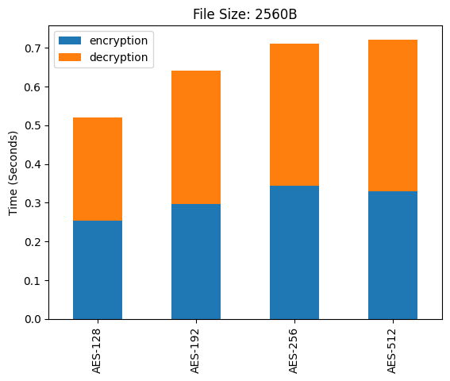

# 0 EXPERIMENTAL ANALYSIS AND RESULTS

## 0.1 Working of AES-512

### 0.1.1  Encryption

### 0.1.2  Decryption

Decrypting using correct symmetric key

Decrypting using incorrect symmetric key
 

 

## 0.2 Performance Comparisons of AES-512 with AES-128, 192 and 256

### 0.2.1 Key Scheduling Time

The observation of the Key Scheduling time for AES algorithm on 1,00,000 keys (1 lakh).

The Observation Table of key scheduling time is given below where the mean, maximum and minimum time is represented in microseconds

| |	128 | 192 | 256 | 512 |
| --- | :---: | :---: | :---: | :---: | 
|mean|	223|	240|	272|	448|
|min|	190|	201|	235|	403|
|max|	9403|	4878|	3578|	3369|

#### Box Plot

The Box Plot of the observation

| With Outlier | Without Outlier |
| :---: | :---: |
|  |  |
| No Quantile Capping | (12.5 - 87.5)% Quantile Capping |

#### Throughput

Throughput of Bytes generated per seconds in Key Expansions

| AES | State Size (Bytes) | Key Size(Bytes) | Expansion | Total Bytes | Average Time | Throughput (Bytes/μ sec) |
| :---: | :---: | :---: | :---: | :---: | :---: | :---: |
| 128 | 16 | 16 | 10 | 160 | 223 | 0.72 |
| 192 | 16 | 24 | 8 | 192 | 240 | 0.80 |
| 256 | 16 | 32 | 7 | 224 | 272 | 0.82 |
| 512 | 64 | 64 | 10 | 640 | 448 | 1.43 |

 

#### Observation
- We can observe that the proposed AES-512 algorithm takes twice the time than AES-128
- There exist certain key combination for which AES-512 is even faster than traditional AES.
- However, the traditional AES key scheduling works on 128 bit state but AES-512 works on 512 bit state. Therfore we can observe that the Throughput for AES-512 higher than other AES variants.
- In the worst case, AES-512 can be delyed upto 3 milliseconds which is around 1/100th of the second considering that Key Expansion occur only once while encrypting and decrypting.

### 0.2.2 Variation in Key Scheduling

We will analyse the correlation between the original secret key with the last key obtained in the key scheduling algorithms. As it is observed that AES-256 generate weaker round keys as compared to AES-128, therfore we will try to analysis this statement and will test the key variation of AES-512 algorithm . We will be using a module in Python Programming Language called **numpy** which provides a function called *corrcoef* which calculate the Pearson product-moment correlation coefficeints of single and double dimensional array.

The analysis of secret key and last round keys for 1,00,000 (1 lakh) observation, where the symbol 'ρ' represents the new state generate is strong when the corelation is in range 0.25 to -0.25

#### Heatmap of Co-relation

| AES-128 | AES-192 |
| :---: | :---: | 
|  |  |

| AES-256 | AES-512 |
| :---: | :---: | 
|  |  |

| AES | Required element | Co-relation ≤  0.25 |  ρ % |
| :---: | :---: |  :---: | :---: |
| 128 | 22 | 22 | 100 |
| 192 | 4 | 22 | 18.18 |
| 256 | 3 | 22 | 13.64 |
| 512 | 73 | 92 | 79.35 |

#### Comparison of all AES variants

#### Observation

- AES-128 Key Schedule have less corelation hence it is produces more varaition
- AES-256 and AES-192 is mainly have high corelation or high negative corelation
- AES-512 have slightly more corelation as compared to AES-128
- The order of key variations: AES-128 > AES-512 > AES-192 ≈ AES-256

### 0.2.3 Encryption and Decryption Time

The analysis of the time taken by the AES algorithm to perform encryption and decryption for different file sizes are

| 64B | 512B / 0.5KB |
| :---: | :---: | 
|  |  |

| 1024B / 1KB | 2560B / 2.5KB |
| :---: | :---: | 
|  |  |

| 5120B / 5KB | 10240B / 10KB |
| :---: | :---: | 
|  |  |

#### Observation

- AES-512 takes nearly same time as compared to other AES variants mainly AES-256
- However as the size of data increases the performance of AES-512 increases .

<!-- - - - 

Final Semester / Not Completed

## 0.3 Performance of Steganography

### 0.3.1 Throughput (Efficiency / UsefulData Ratio)

### 0.2.2 Error Detection 

- - - 

Final Semester / Not Completed

## 0.4 Working Prototype

### 0.4.1 Testing: Sender to Server

### 0.3.2 Testing: Server to Receiver

### 0.4.3 Data Integrity Test using BlockChain
Can a user know if the data in server is manipulated -->